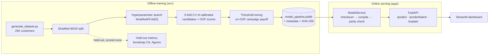
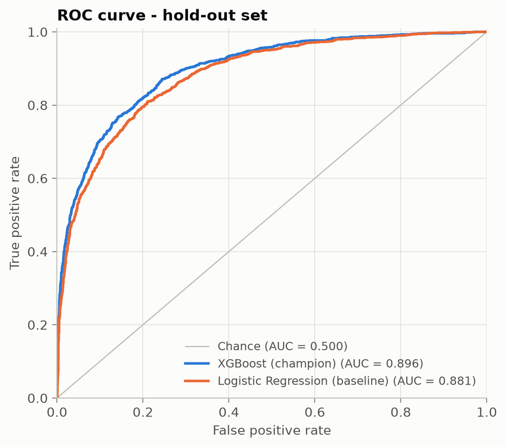
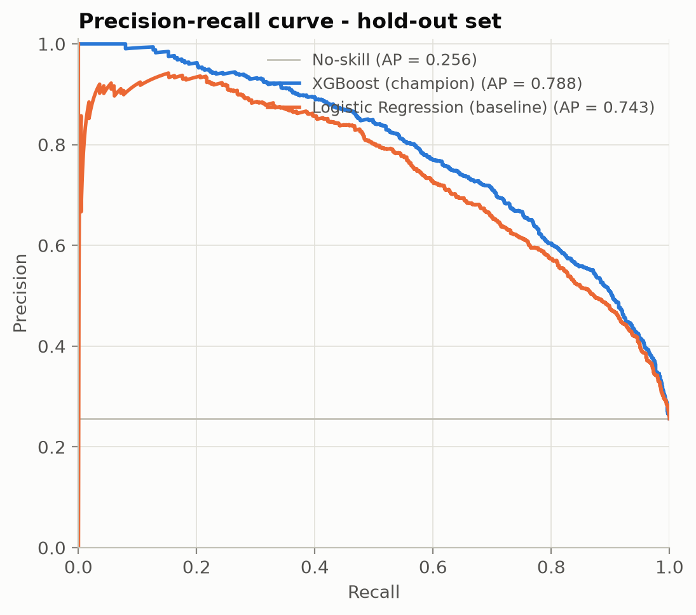
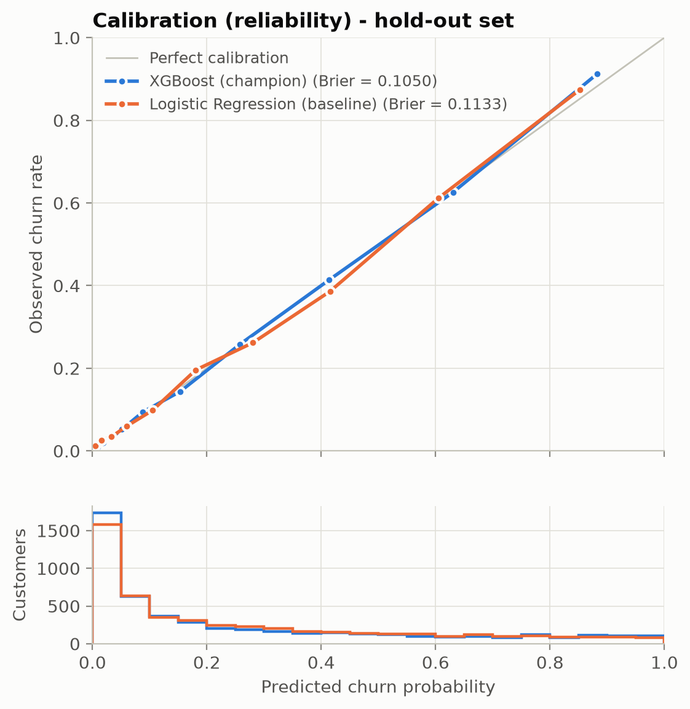
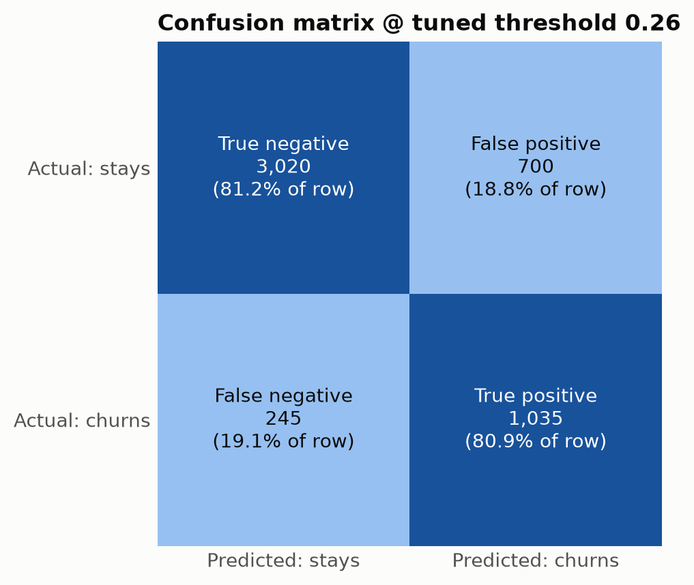
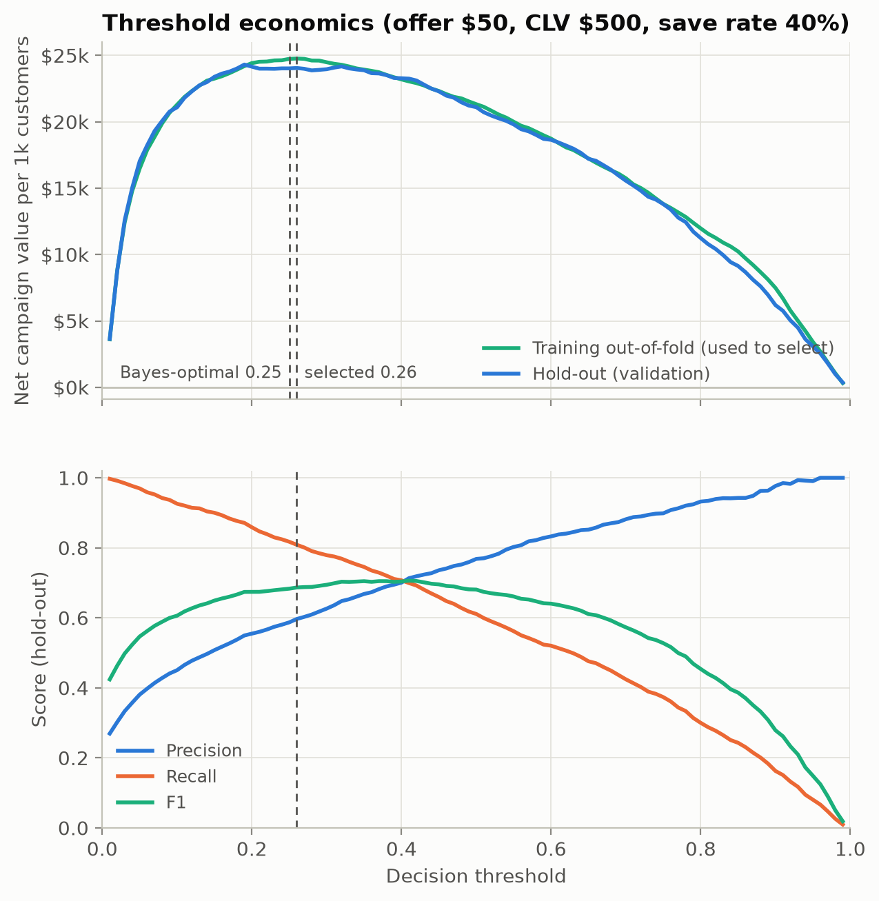
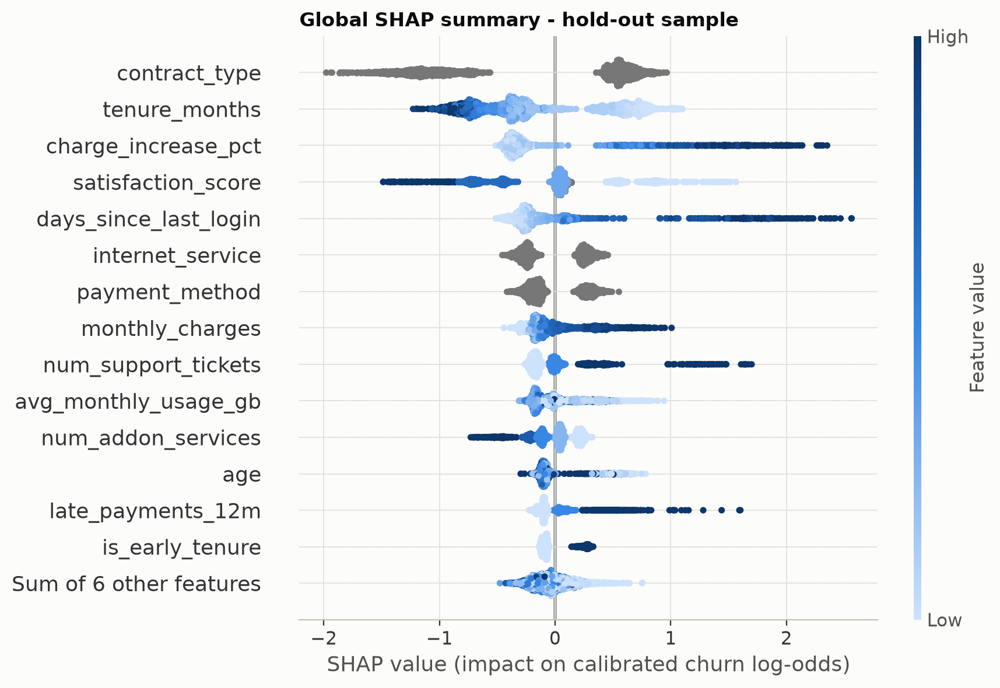

# Churn Prediction: End-to-End ML Pipeline & Real-Time Inference Service

A production-style customer-churn system: a **leakage-free scikit-learn / XGBoost pipeline**
tuned with stratified 5-fold cross-validation, **calibrated probabilities** and a **decision
threshold chosen for campaign ROI**, served by a **FastAPI microservice** with strict Pydantic v2
contracts and **sub-4 ms p95 server-side latency** in its container, plus a **Streamlit dashboard** with live
SHAP explanations and an interactive threshold explorer.

| | Result |
|---|---|
| **5-fold CV ROC-AUC** (XGBoost, calibrated) | **0.896 ± 0.007** |
| **Hold-out ROC-AUC** (5,000 unseen customers) | **0.896** (95% bootstrap CI 0.886 – 0.907) |
| Hold-out PR-AUC / Brier / ECE | 0.788 / 0.105 / 0.012 |
| Lift over logistic-regression baseline | +0.015 ROC-AUC (paired 95% CI +0.011 – +0.019), +0.045 PR-AUC |
| Campaign value on hold-out, tuned threshold vs. default 0.5 | **$120,250 vs. $105,500** (+14%) |
| `/predict` server-side latency, Docker (2,000 requests) | **p50 2.3 ms · p95 3.9 ms · p99 6.1 ms** |
| Test suite | 71 tests (unit, API integration, model regression gates), 94% line coverage |

> **Data note:** the dataset is synthetic (`data/generate_dataset.py`), generated with realistic
> non-linear churn drivers, latent (unobserved) factors, and data-quality problems. It's built to
> exercise the engineering end to end, not to make claims about any real business.

---

## Architecture



The serialized artifact is **one scikit-learn `Pipeline`**, so training and serving can't drift apart:

```text
SchemaEnforcer ─► FeatureEngineer ─► ColumnTransformer ───────────────► PlattCalibratedClassifier
(contract,        (price-increase,    ├ num:  median impute + missing    (XGBoost, sigmoid map fit on
 drift policy)     avg spend,         │       indicators (+ scaling)       out-of-fold log-odds)
                   early tenure)      ├ cat:  impute + one-hot (unseen → 0)
                                      └ bool: most-frequent impute
```

## Results

All figures are generated by `python src/evaluate.py` from the saved artifacts.

| ROC | Precision-recall |
|---|---|
|  |  |
| **Calibration** | **Confusion matrix @ tuned threshold** |
|  |  |

### Cross-validation (stratified 5-fold, training split)

| Metric | XGBoost (champion) | Logistic Regression (baseline) |
|---|---|---|
| ROC-AUC | **0.8963 ± 0.0068** | 0.8844 ± 0.0043 |
| PR-AUC | **0.7853 ± 0.0117** | 0.7569 ± 0.0080 |
| F1 @ 0.5 | **0.683 ± 0.013** | 0.655 ± 0.013 |
| Brier score | **0.1052 ± 0.0032** | 0.1114 ± 0.0017 |
| Log-loss | **0.339 ± 0.010** | 0.359 ± 0.006 |

The CV numbers come from the same folds used for tuning, so they're slightly optimistic. The
hold-out numbers are the unbiased estimate: the test set is scored exactly once, after model
selection and threshold tuning.

### Decision threshold: optimized for money, not accuracy

Every flagged customer gets a $50 retention offer. A saved churner is worth $500 × a 40%
save rate. The threshold is chosen to maximize expected campaign value on **out-of-fold training
predictions**, never on the test set.



- The tuned threshold is **0.26**. Theory says a perfectly calibrated model should flag customers
  above p = 50 / (150 + 50) = **0.25**. The two agree, which independently confirms the probabilities
  are calibrated.
- On the hold-out set that threshold captures **81% of churners** (precision 60%) and yields
  **$120,250** net value, compared with $105,500 at the default 0.5, $118,200 at the F1-optimal
  0.37, and $6,000 for contacting everyone.

### Global explanations



The top drivers are contract type, tenure, the engineered **price-increase** feature (current bill
vs. lifetime average), satisfaction, and days since last login. No single raw column exposes a
price increase, so the engineered feature carries real signal.

## Serving performance

Measured with `scripts/benchmark_latency.py`: 2,000 sequential `/predict` calls using real hold-out
customers over a keep-alive connection, on a 4-core Intel i5-1035G7 laptop (Balanced power plan).
Raw results are in [`artifacts/latency_benchmark.json`](artifacts/latency_benchmark.json).

| Environment | Server processing p50 / p95 / p99 | Client round-trip p95 | Batch of 1,000 |
|---|---|---|---|
| **Docker (Linux container, uvloop)** | **2.3 / 3.9 / 6.1 ms** | 13.8 ms | 99 ms (≈ 10,000 rows/s) |
| Native Windows (uvicorn) | 4.8 / 7.6 / 10.0 ms | 15.4 ms | 142 ms (≈ 7,000 rows/s) |

Server processing comes from the `X-Process-Time-Ms` header. Client round-trip adds the Python
`requests` client and loopback networking (plus Docker Desktop port forwarding for the container).

**How:** on this hardware, scoring one row through the stock sklearn pipeline took ~43 ms, almost
all of it fixed per-call overhead in pandas and `ColumnTransformer` (validation, DataFrame
construction, joblib dispatch). The transform alone cost about the same for 1 row as for 1,000. At load time, `src/serving.py` compiles the *fitted* pipeline (imputation medians,
missing-indicator columns, one-hot vocabularies, calibration map, booster) into a NumPy path that
reuses the same schema and feature functions. The service keeps it only if it matches
`pipeline.predict_proba` within 1e-6 on startup probe rows (null, malformed, unseen-category, and
boundary records). Otherwise it falls back to sklearn. Measured parity on the 5,000-row hold-out
is 8e-8, which is float32 rounding inside XGBoost. Result: single-row inference went from ~43 ms
to ~2.6 ms, with no second artifact to keep in sync.

## Quickstart

### Local (Python 3.12+)

```bash
python -m venv .venv && source .venv/bin/activate      # Windows: .venv\Scripts\activate
pip install -r requirements-dev.txt

python data/generate_dataset.py      # 25K customers -> data/churn_dataset.csv
python src/train.py                  # CV + tuning + calibration + threshold -> artifacts/
python src/evaluate.py               # figures -> artifacts/figures/
pytest                               # 71 tests

uvicorn app.main:app --port 8000     # API docs: http://localhost:8000/docs
streamlit run frontend/dashboard.py  # dashboard: http://localhost:8501
```

`python src/train.py --fast` runs a 4-candidate search (~3 min instead of ~20 min on a 4-core
laptop). It reaches essentially the same hold-out ROC-AUC (0.895 vs. 0.896).

### Docker

```bash
docker compose up -d --build
```

- API: <http://localhost:8000/docs>
- Dashboard: <http://localhost:8501>

The image **trains the model during the build** (a `trainer` stage). The pickled pipeline is
therefore always loaded by the exact scikit-learn / XGBoost versions that produced it. The build
runs the full 30-candidate search. For a much faster build, run
`TRAIN_ARGS=--fast docker compose up -d --build`.

Build details:

- `api` target: lean dependency set (no SHAP, numba, or Streamlit), non-root user, read-only root
  filesystem, `no-new-privileges`, and a `/health` healthcheck.
- `dashboard` target: waits for the API to report healthy before starting.

## API

| Method & path | Purpose |
|---|---|
| `GET /health` | Liveness/readiness: model status, version, threshold, uptime (503 if the model failed to load) |
| `POST /predict` | One customer → calibrated `churn_probability`, `churn_prediction`, `risk_tier` |
| `POST /predict/batch` | 1–1,000 customers in one vectorized call |
| `POST /explain` | Exact TreeSHAP attribution per input feature (sums to the prediction's log-odds) |
| `GET /model/info` | Version, hyperparameters, calibration, thresholds, feature schema, hold-out metrics, inference path |
| `GET /metrics` | Rolling per-route latency p50/p95/p99 |

Every response carries `X-Process-Time-Ms`, `X-Latency-P50-Ms` and `X-Latency-P95-Ms` headers.

```bash
curl -s -X POST localhost:8000/predict -H 'content-type: application/json' -d '{
  "customer_id": "CUST-004242", "age": 29, "tenure_months": 4, "monthly_charges": 94.5,
  "total_charges": 310.2, "num_support_tickets": 3, "avg_monthly_usage_gb": 120.0,
  "days_since_last_login": 21, "num_addon_services": 0, "satisfaction_score": 2,
  "late_payments_12m": 1, "contract_type": "month_to_month", "payment_method": "electronic_check",
  "internet_service": "fiber_optic", "plan_tier": "standard", "region": "west",
  "paperless_billing": true, "has_partner": false}'
```

```json
{"customer_id": "CUST-004242", "churn_probability": 0.9929, "churn_prediction": true,
 "risk_tier": "high", "decision_threshold": 0.26, "model_version": "xgboost-20260926T021020Z-111b5dba"}
```

The request contract is strict: unknown fields, wrong JSON types (e.g. `"12"` for an integer),
out-of-range values, and unknown category levels all return **422**. `satisfaction_score`,
`total_charges` and `avg_monthly_usage_gb` accept `null`; the pipeline imputes them and records
the missingness as a feature.

## Design decisions

- **No leakage.** Every statistic (imputation medians, one-hot vocabularies, scaler moments, the
  calibration map) is fit inside `Pipeline.fit`, so each CV fold refits the whole chain on its own
  rows. Feature engineering is stateless. `customer_id` is never a feature. Tests assert that
  imputer medians come only from the rows the model was fit on.
- **Schema-drift policy** (`SchemaEnforcer`, defense in depth behind the API's validation):
  - A missing column fails loudly with `SchemaError`.
  - Extra columns are dropped, and column order doesn't matter.
  - Numeric strings are coerced.
  - Impossible values (negative tenure, age 250) become missing and are imputed.
  - Category formatting (`" Month-To-Month"`) is normalized.
  - Unseen categories encode to all-zeros.
- **Informative missingness.** Customers who skip satisfaction surveys churn more, so
  `add_indicator=True` keeps "was missing" as a signal instead of erasing it with the median.
- **Calibration that keeps SHAP exact.** Platt scaling is fit on *out-of-fold* log-odds and is
  affine in log-odds space. TreeSHAP values therefore stay exact after calibration
  (φ′ = slope·φ), and `/explain` contributions sum exactly to the served probability.
  - Hold-out ECE: 0.012.
  - Fitted map: slope 1.04, intercept 0.04. XGBoost was already close to calibrated, and the layer
    guarantees it.
- **SHAP without the `shap` runtime.** The API uses XGBoost's native `pred_contribs` (exact
  TreeSHAP), summing one-hot and indicator columns back to the field the caller sent. The API image
  stays free of numba/llvmlite. The `shap` library is used only for offline plots.
- **Integrity and ops.**
  - The artifact's SHA-256 is recorded at training time and verified at load.
  - A warm-up call runs before `/health` reports OK.
  - Pure-ASGI timing middleware keeps a rolling per-route latency window.
  - Single-row `/predict` runs inline on the event loop (~3 ms CPU, cheaper than a threadpool hop);
    batch and explain run in the threadpool so they never stall health checks.

## Testing & CI

`pytest` trains a small model into a temp directory once per session, so the suite is
hermetic. It never reads or overwrites your local artifacts.

| File | Covers |
|---|---|
| `tests/test_data_pipeline.py` | Generator determinism; null / invalid-category / dtype / column drift handling; feature math; leakage checks; compiled-path parity (hold-out, messy rows, linear models); SHAP additivity; ECE, Bayes-threshold recovery, bootstrap CIs |
| `tests/test_api.py` | 200s, eight kinds of 422, batch ordering / limits / per-index errors, 1,000-row batch throughput, `/explain` additivity, 503 when the model is missing, latency headers, p95 guardrail |
| `tests/test_model_performance.py` | Regression gates: hold-out ROC-AUC > 0.80, Brier skill, monotone calibration, threshold sanity, tuned threshold beats 0.5, plus a gate on the real 25K artifact when present |

`.github/workflows/ml_ci.yml` runs on every push:

1. `black --check` and `flake8`.
2. Dataset generation, fast training, evaluation, and the full test suite with coverage. The
   metrics and figures are uploaded as workflow artifacts.
3. A Docker build of the API image, then a smoke test that `/predict` works and the container runs
   as the non-root user.

## Project structure

```text
├── Dockerfile                  # multi-stage: deps → trainer → api / dashboard (non-root)
├── docker-compose.yml          # API + dashboard, health-gated startup
├── requirements-api.txt        # lean serving deps (API image)
├── requirements.txt            # + training, SHAP plots, dashboard
├── requirements-dev.txt        # + pytest, coverage, black, flake8
├── .github/workflows/ml_ci.yml
├── data/generate_dataset.py    # 25K synthetic customers with realistic data-quality issues
├── artifacts/                  # metrics.json, model_metadata.json, figures/ (binaries gitignored)
├── src/
│   ├── config.py               # feature contract, search spaces, cost model, artifact paths
│   ├── data.py                 # loading + deterministic stratified split
│   ├── pipeline.py             # SchemaEnforcer, FeatureEngineer, ColumnTransformer, Platt calibrator
│   ├── train.py                # search → CV → champion → threshold → refit → hold-out → persist
│   ├── evaluate.py             # ROC, PR, calibration, confusion matrix, threshold, SHAP figures
│   ├── metrics.py              # metrics, ECE, threshold economics, stratified bootstrap
│   ├── explain.py              # exact TreeSHAP / linear SHAP grouped by input feature
│   └── serving.py              # compiled NumPy inference path + parity verification
├── app/
│   ├── schemas.py              # Pydantic v2 contracts
│   ├── service.py              # model loading, checksum, compiled path, cached inference
│   ├── middleware.py           # ASGI latency tracking (p50/p95/p99)
│   └── main.py                 # FastAPI routes
├── frontend/dashboard.py       # Streamlit: sandbox + SHAP waterfall, threshold explorer, report
├── scripts/benchmark_latency.py
└── tests/
```
